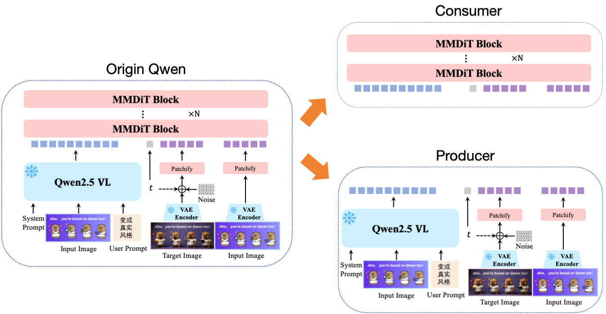
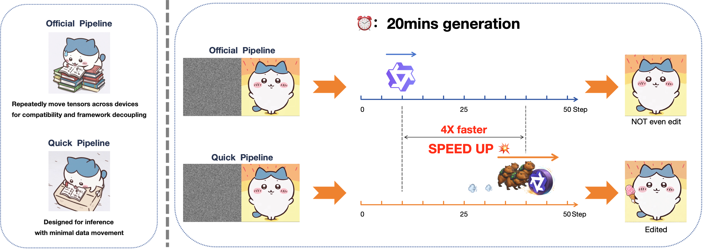

# QwenImageEdit_MultiGPU


A lightweight, clean implementation of **Qwen-Image-Edit** supporting inference + LoRA fine‑tuning on **multi‑GPU (8×V100)** setups.

---
⚡️ New Features / Updates

**Added ddp_consumer**:
A version of the consumer that supports DistributedDataParallel (DDP).
> **⚠️ Note:** PEFT and DeepSpeed may have limited compatibility, especially on V100 GPUs when using quantization.

---

## 📦 Installation

**Requirements:**

- Python 3.10

1. Install required packages:
   ```bash
   pip install -r requirements.txt
   ```

2. Install the latest `diffusers` from GitHub:
   ```bash
   pip install git+https://github.com/huggingface/diffusers
   ```

3. In case you encounter an error like the following:  
   ```
   AttributeError: 'dict' object has no attribute 'to_dict'
   ```
   **How to fix it**
   ```bash
   pip install --upgrade diffusers transformers accelerate
   ```
---
## 🏋️ Training Workflow

Training now follows a **two‑stage pipeline**:



### 1. Precompute embeddings  
Run the producer script:
```bash
cd qwen_lora
bash produce.sh
```
This step processes your dataset and saves precomputed embeddings for the trainer.

### 2. Train LoRA  
After produce has finished:
```bash
bash consume.sh
```
This launches the LoRA trainer based on the new architecture.

---
## 🚀 Inference


You now have **two** inference choices:

### Option A — Rewritten Fast Pipeline (recommended)
Located in `qwen_infer/vanillaPipeline.py`.

Run:

```bash
cd qwen_infer
python quick_infer.py
```

**Advantages:**
- Completely rewritten pipeline  
- customized transformer behavior(optional)  
- Generates results much quicker than the official pipeline  

### Option B — Official Pipeline w/ Multi‑GPU  
If you still need the “official” behavior:

```bash
python infer.py
```

**Note:**  
The official pipeline may take **~1h20m per image**.  
The rewritten pipeline takes about **20 minutes** and is suitable for most use cases.

---

## 📏 Recommended Resolution for Quick Validation

If you just want to **inspect LoRA training quality**,  
use **512×512** resolution during inference.

This significantly reduces compute load and speeds up iteration.The whole generation will cost **only 6 mins**(50 steps).
> By going a step further and turning off CFG entirely—for instance, by providing an empty negative prompt-the runtime drops to around 3 minutes.

---

## 📂 Project Structure

```
qwen_image/
│
├── README.md
├── requirements.txt
│
├── qwen_lora/
│   ├── produce.sh
│   ├── consume.sh
│   ├── producer.py
│   ├── pp_consumer.py
│   ├── ddp_consumer.py
│   ├── preprocess_dataset.py
│   └── wrapped_tools.py
│
└── qwen_infer/
    ├── quick_infer.py
    ├── infer.py
    ├── vanillaPipeline.py
    └── wrapped_tools.py
```

---

## 🌟 Summary

- Environment unified → install once at top level  
- Training = **produce → consume**  
- Inference = **rewritten fast pipeline** (recommended) or **official pipeline**  
- Transformer behaviors can be easily customized through modifications to wrapped_tool.py
- Use **512 resolution** when quickly checking training results  

Enjoy your multi‑GPU Qwen‑Image‑Edit workflow. ❤️


## Star History

If you find this project helpful or interesting, a star would be greatly appreciated! Your support motivates us to keep improving. ⭐


[](https://www.star-history.com/#SuyangLumiere/QwenImageEdit_MultiGPU&type=date&legend=top-left)
